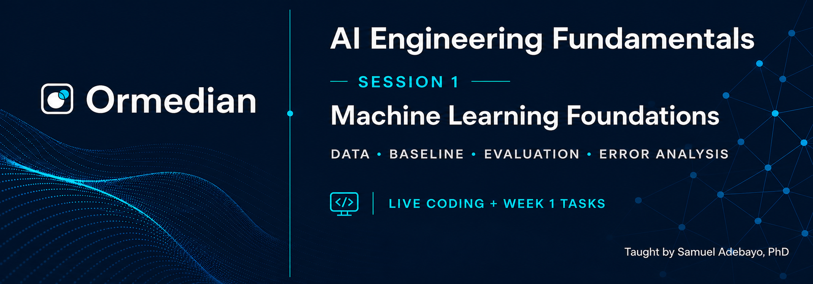

<p align="center">
  
</p>

# Session 1: Machine-learning foundations

This session builds the foundations needed to work safely on a real
machine-learning project. You will inspect and clean data, create honest data
splits, establish a baseline, train a text classifier, evaluate it with
multiple metrics and analyse its errors.

The example system classifies short support messages into six intents:

```text
refund_request
cancel_order
invoice_status
technical_support
account_update
general_enquiry
```

## Student materials

```text
Session-1/
├── assets/       Final course branding
├── data/         Synthetic raw and processed datasets
├── docs/         Assignment and learner reference material
├── notebooks/    Guided lesson and independent assignment
├── scripts/      Convenience commands
├── src/          Reusable data, modelling and evaluation code
└── tests/        Automated checks
```

The notebooks are:

- `notebooks/01_live_coding_student.ipynb` — guided lesson with checkpoints
  and TODO cells.
- `notebooks/02_week_1_assignment.ipynb` — independent Week 1 assignment.

## Setup

From this directory:

```bash
python3 -m venv .venv
source .venv/bin/activate
python -m pip install --upgrade pip
python -m pip install -r requirements.txt
python -m jupyter lab
```

On Windows PowerShell:

```powershell
py -m venv .venv
.venv\Scripts\Activate.ps1
python -m pip install --upgrade pip
python -m pip install -r requirements.txt
python -m jupyter lab
```

The exact dependency versions used to validate the materials are recorded in
`requirements-tested.txt`.

## Verify your environment

```bash
python -m pytest -q
```

You can also run the command-line experiment:

```bash
python -m src.train \
  --experiment unigram \
  --output-dir results/session_1
```

Generated results are ignored by Git.

## Learning outcomes

By the end of Session 1, you should be able to:

1. Explain examples, features, labels, targets and predictions.
2. Distinguish classification from regression.
3. Explain the purpose of training, validation and test sets.
4. Establish and interpret a simple baseline.
5. Train a TF-IDF and logistic-regression text classifier.
6. Interpret accuracy, precision, recall, macro F1 and confusion matrices.
7. Recognise underfitting, overfitting and data leakage.
8. Inspect wrong predictions and propose evidence-based improvements.
9. Record and explain one controlled experiment.

## Assignment

Read [the Week 1 assignment](docs/WEEK_1_ASSIGNMENT.md), complete
`notebooks/02_week_1_assignment.ipynb`, and use the templates in `docs/` to
record your reflection, paper notes and learning log.

The data is synthetic and contains no real customer information. See
[`data/DATA_CARD.md`](data/DATA_CARD.md) for its limitations and
responsible-use notes.
